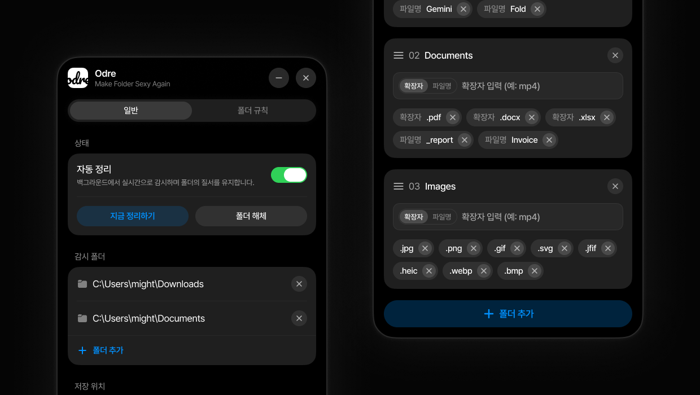
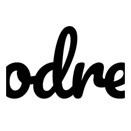

<div align="center">
  
  <br/><br/>
  
  <p align="center">
    <strong>"Odre"</strong><br />
    복잡한 바탕화면과 다운로드 폴더를 정리하는 가장 완벽하고 가벼운 방법.
  </p>

  <p align="center">
    
    
    
    <a href="https://github.com/mightyidler/Odre/blob/main/LICENSE">
      
    </a>
  </p>

  <br />
</div>

---

## ✨ Features

- **실시간 폴더 모니터링 (Real-time Monitoring)**: `notify` 크레이트를 활용하여 파일 생성/이동 이벤트를 지연 없이 빠르게 감지합니다.
- **스마트 규칙 엔진 (Smart Rule Engine)**: 파일의 확장자나 파일명 패턴에 따라 원하는 경로로 깔끔하게 정리해 줍니다.
- **프리미엄 UI (Premium UI/UX)**:
매끄러운 애니메이션 동작과 다크/라이트 테마를 제공합니다.
- **다양한 사용자 제어**: 이동 지연 설정, 파일 중복 처리(덮어쓰기/건너뛰기/이름변경), 윈도우 시작 시 자동 실행 기능 포함.
- **다국어 지원 (Multilingual)**: 한국어, English, 日本語, 中文, Français, Español 완벽 지원.

<br/>

## 🚀 Getting Started

### Prerequisites

Odre 앱을 소스 코드에서 빌드하려면 다음 준비물이 필요합니다.

- [Rust (rustup)](https://rustup.rs)
- [Node.js LTS](https://nodejs.org)
- [Visual Studio C++ Build Tools](https://visualstudio.microsoft.com/visual-cpp-build-tools/) (`Desktop development with C++` 워크로드 설치 필수)

### Installation & Development

1. **레포지토리 클론 (Clone the repository)**
   ```powershell
   git clone https://github.com/mightyidler/Odre.git
   cd Odre
   ```

2. **패키지 설치 및 개발 모드 실행 (Run)**
   ```powershell
   npm install
   npm run dev
   ```

3. **설치 파일 빌드 (Build installer)**
   ```powershell
   npm run build
   ```
   > 💡 빌드가 완료된 `.exe` 설치 파일은 `src-tauri/target/release/bundle/nsis/` 경로에 생성됩니다.

<br/>

## 📁 Project Structure

```text
odre/
├── src/                  # 프론트엔드 (프레임워크 없는 순수 Vanilla JS, CSS)
│   ├── index.html        # 메인 UI 레이아웃
│   ├── style.css         # 미니멀리즘 인터페이스 및 부드러운 모션 스타일링
│   └── app.js            # UI 로직 및 Tauri Invoke 바인딩
├── src-tauri/            # 백엔드 (Rust)
│   ├── src/
│   │   ├── main.rs       # 프로그램 진입점 (Tray 아이콘 및 앱 초기화)
│   │   └── lib.rs        # 파일 모니터링, 타이머, 규칙 엔진의 핵심 로직 핸들러
│   ├── tauri.conf.json   # Tauri 및 NSIS 인스톨러 환경설정
│   └── Cargo.toml        # Rust 의존성 파일
├── package.json          # Node.js 의존성 관리 및 빌드 스크립트
└── README.md             # 현재 문서
```

<br/>

## 🛠️ Stack

- **Frontend**: Vanilla HTML / CSS / JavaScript
- **Backend**: Rust (Tauri 2.0 framework)
- **Core Libs**: `notify` (Real-time File Watcher), `dirs` (Path Resolution)

<br/>

## 📄 License

Odre 프로젝트는 [MIT License](LICENSE)의 적용을 받습니다. 자유롭게 사용 및 수정이 가능합니다.
